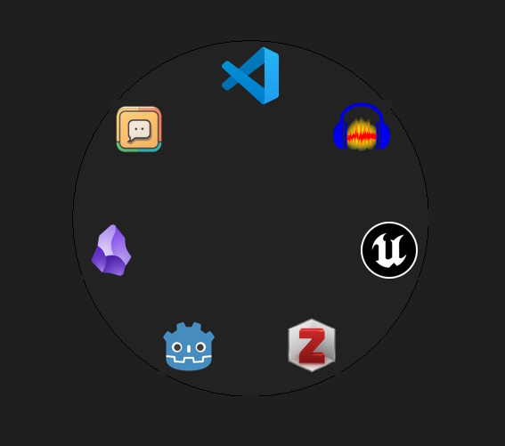
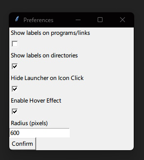

# Simple Python Application Launcher

A versatile and easy-to-use application launcher built with Python, allowing quick access to your favorite applications and directories.

## Features

* **Quick Access**: Use `Ctrl + Space` to activate the launcher at your cursor's position.
* **Drag and Drop**: Easily add `.exe` or `.lnk` files by dragging and dropping them onto the launcher.
* **Folder Support**: Add directories the same way you add applications.
* **Bulk Shortcut Adding**: Drag multiple folders at once to add multiple shortcuts in one go.
* **Easy Removal**: Right-click an icon to remove it from the launcher.
* **Convenient Exit**: Right-click the background and select "Quit" to exit the launcher.
* **Preferences Menu**: Access additional settings through the right-click context menu.

## Usage

1. **Launch the Application**:
   * Use `Ctrl + Space` to bring up the launcher at the center of your cursor.
2. **Add Applications and Folders**:
   * Drag and drop a `.exe` file or `.lnk` file onto the launcher to add it.
   * Alternatively, you can add folders by dragging and dropping them.
3. **Bulk Adding**:
   * Select multiple folders and drag them onto the launcher to add their shortcuts simultaneously.
4. **Remove Icons**:
   * Right-click on any icon you want to remove.
5. **Quit the Launcher**:
   * Right-click the background and select "Quit" from the context menu.

## Preferences Menu

Access the Preferences menu by right-clicking on the launcher background and selecting "Preferences". Here, you can customize your launcher to fit your needs

## Build Instructions

To build the application, follow these steps:

1. Install the required dependencies: `pip install -r requirements.txt`
2. Build the executable using PyInstaller: `python -m PyInstaller -F -w main.py --additional-hooks-dir=.dsa`

## Dependencies

Ensure you have all dependencies listed in `requirements.txt` installed to successfully run and build the application.

[Folder](https://icons8.com/icon/Vps0Nsl80v4P/folder) icon by [Icons8](https://icons8.com)
