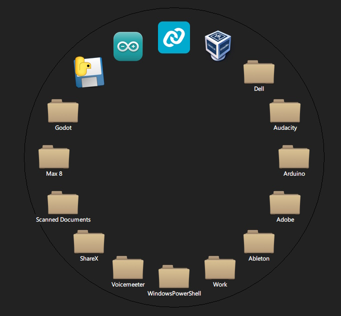

# Simple Python Application Launcher

Usage:
Ctrl + Space will pop up an application launcher at the center of your cursor
To add applications, drag and drop an exe file or .lnk file
To remove, right click the icon of the program you want to remove
To quit, right click the background and click quit

